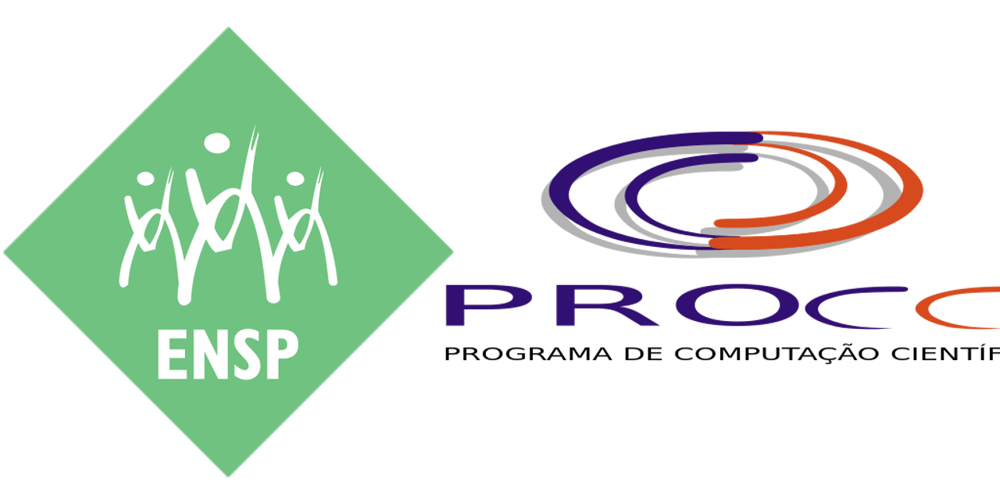

```{=html}
<!-- Header com Logos -->
<div class="header-banner">
  <div class="header-content">
    <div class="logo-row">
      <div class="logo-left">
        
      </div>
      <div class="header-center">
        <div class="header-text">
          <h1>Curso R Online</h1>
          <h2>Programa de Pós-Graduação em Epidemiologia em Saúde Pública</h2>
        </div>
      </div>
      <div class="logo-right">
        
      </div>
    </div>
  </div>
</div>

<!-- Seção Sobre o Criador - Simplificada -->
<div class="about-creator">
  <div class="creator-bio">
    <p>Este curso foi desenvolvido pelo <strong>pesquisador Dr. Oswaldo Gonçalves Cruz</strong>, que é docente permanente do Programa de Pós-Graduação em Epidemiologia e Saúde Pública da ENSP/FIOCRUZ e membro do Departamento de Computação Científica (PROCC) da Fundação Oswaldo Cruz. Suas principais áreas de atuação incluem análise de dados espaciais, vigilância epidemiológica, análise espaço-temporal, violência, métodos de análise de microáreas, mineração de dados e bioestatística. O Prof. Oswaldo dedica-se ao ensino e pesquisa em computação científica aplicada à saúde pública, contribuindo significativamente para a formação de profissionais na área de epidemiologia.</p>
  </div>
</div>
```

```{=html}
<!-- Proteção por Senha -->
<div id="password-container">
  <h3><i class="fas fa-lock"></i> Acesso Restrito</h3>
  <p>Por favor, insira a senha para acessar as videoaulas do curso.</p>
  <input type="password" id="password-input" placeholder="Digite a senha..." />
  <button id="submit-btn"><i class="fas fa-sign-in-alt"></i> Acessar</button>
  <p id="error-message"><i class="fas fa-exclamation-circle"></i> Senha incorreta. Tente novamente.</p>
</div>

<!-- Conteúdo Protegido -->
<div id="protected-content">

<div class="content-intro">
  <h2><i class="fas fa-book"></i> Conteúdo do Curso</h2>
  <p>O Curso está dividido em aulas de no máximo 15 minutos, permitindo um aprendizado progressivo e flexível!</p>
  <p><strong>Antes de mais nada</strong> você deve assistir a aula de apresentação e em seguida as aulas de como instalar o <strong>R</strong> e o <strong>RStudio</strong>.</p>
  <p>Após ter seu ambiente devidamente configurado, siga as instruções de cada vídeo e procure ir acompanhando e reproduzindo os comandos apresentados. Caso o andamento da aula esteja muito rápido, você pode retornar ou pausar o vídeo quando e quantas vezes quiser.</p>
  
</div>

<div class="video-card">
  <h3>Apresentação do Curso</h3>
  <p>Vídeo de introdução ao curso de R, apresentando a metodologia, objetivos e estrutura das aulas.</p>
  <a href="https://drive.google.com/file/d/1uev4KD3K2zqemFFFyT89RDQ0ccHUhEmh/view?usp=sharing" class="download-btn" target="_blank"><i class="fas fa-download"></i> Baixar Vídeo</a>
</div>

<div class="video-card">
  <h3>Instalação e Configuração do R e RStudio</h3>
  <p>Conjunto completo de videoaulas para instalação do R, RStudio e configuração do ambiente.</p>
  
  <ul style="list-style: none; padding: 0; margin: 10px 0;">
    <li style="margin-bottom: 10px;">
      <a href="https://drive.google.com/file/d/1CD47DYrMUnZZeRu2C1Fr7wyCnjC3ArlX/view?usp=drive_link" class="download-btn" target="_blank" style="display: inline-block; text-decoration: none; background-color: #007bff; color: white; padding: 8px 15px; border-radius: 5px; margin-top: 5px;">
        <i class="fas fa-download"></i> Baixar Vídeo - Instalação do R
      </a>
    </li>
    <li style="margin-bottom: 10px;">
      <a href="https://drive.google.com/file/d/1rMYid4qrkH55k3WK92XNOubyhAD0GY3s/view?usp=drive_link" class="download-btn" target="_blank" style="display: inline-block; text-decoration: none; background-color: #007bff; color: white; padding: 8px 15px; border-radius: 5px; margin-top: 5px;">
        <i class="fas fa-download"></i> Baixar Vídeo - Instalação do RStudio
      </a>
    </li>
    <li style="margin-bottom: 10px;">
      <a href="https://drive.google.com/file/d/1o1Wjvbmh619JTwVdpjxgW9LLjw8X1QYU/view?usp=sharing" class="download-btn" target="_blank" style="display: inline-block; text-decoration: none; background-color: #007bff; color: white; padding: 8px 15px; border-radius: 5px; margin-top: 5px;">
        <i class="fas fa-download"></i> Baixar Vídeo - Configuração do RStudio
      </a>
    </li>
  </ul>
</div>

<div class="video-card">
  <h3>Aula 1 - Introdução ao R</h3>
  <p>Primeiros passos com a linguagem R e interface do RStudio. Conceitos fundamentais e primeiros comandos.</p>
  <a href="https://drive.google.com/file/d/1007noIbW52h3EHErrpD_KtejJ4rOQgnG/view?usp=sharing" class="download-btn" target="_blank"><i class="fas fa-download"></i> Baixar Vídeo</a>
</div>

<div class="video-card">
  <h3>Aula 2 - R como Calculadora</h3>
  <p>Operações matemáticas básicas e uso do R como uma calculadora avançada com funções especializadas.</p>
  <a href="https://drive.google.com/file/d/1cOg1eX6w5rZAYSqrm7_VZeKVBVuBq8Tc/view?usp=drive_link" class="download-btn" target="_blank"><i class="fas fa-download"></i> Baixar Vídeo</a>
</div>

<div class="video-card">
  <h3>Aula 3 - Obtendo Ajuda</h3>
  <p>Como utilizar o sistema de ajuda integrado do R para aprender sobre funções, pacotes e resolver dúvidas.</p>
  <a href="https://drive.google.com/file/d/1C-Sk31YxhvzPy75IyfO-Algm5HN_BU0q/view?usp=sharing" class="download-btn" target="_blank"><i class="fas fa-download"></i> Baixar Vídeo</a>
</div>

<div class="video-card">
  <h3>Aula 4 - Objetos no R</h3>
  <p>Conceitos fundamentais sobre objetos no R e como gerenciá-los no ambiente de trabalho.</p>
  
  <ul style="list-style: none; padding: 0; margin: 10px 0;">
    <li style="margin-bottom: 10px;">
      <a href="https://drive.google.com/file/d/1C37Vxtb-FMEmDJciOaGXDSr6vlisaTt_/view?usp=drive_link" class="download-btn" target="_blank" style="display: inline-block; text-decoration: none; background-color: #007bff; color: white; padding: 8px 15px; border-radius: 5px; margin-top: 5px;">
        <i class="fas fa-download"></i> Baixar Vídeo - Objetos no R
      </a>
    </li>
    <li style="margin-bottom: 10px;">
      <a href="https://drive.google.com/file/d/1VJ0rT5JIkwEh17nw7BCZFuEU7MTuEB92/view?usp=sharing" class="download-btn" target="_blank" style="display: inline-block; text-decoration: none; background-color: #007bff; color: white; padding: 8px 15px; border-radius: 5px; margin-top: 5px;">
        <i class="fas fa-download"></i> Baixar Vídeo - Gerenciando Objetos
      </a>
    </li>
  </ul>
</div>

<div class="video-card">
  <h3>Aula 5 - Vetores</h3>
  <p>Criação e manipulação de vetores numéricos, de caracteres e lógicos. Operações com vetores, indexação, extração de elementos e operações vetorizadas.</p>
  
  <ul style="list-style: none; padding: 0; margin: 10px 0;">
    <li style="margin-bottom: 10px;">
      <a href="https://drive.google.com/file/d/1jHxbaeLyrkYwIFgfmi11uzqvpOaAXKul/view?usp=drive_link" class="download-btn" target="_blank" style="display: inline-block; text-decoration: none; background-color: #007bff; color: white; padding: 8px 15px; border-radius: 5px; margin-top: 5px;">
        <i class="fas fa-download"></i> Baixar Vídeo - Vetores - Parte I
      </a>
    </li>
    <li style="margin-bottom: 10px;">
      <a href="https://drive.google.com/file/d/1oNHNietR98cYBBEV0cJOs53ITsxCgJK2/view?usp=drive_link" class="download-btn" target="_blank" style="display: inline-block; text-decoration: none; background-color: #007bff; color: white; padding: 8px 15px; border-radius: 5px; margin-top: 5px;">
        <i class="fas fa-download"></i> Baixar Vídeo - Vetores - Parte II
      </a>
    </li>
  </ul>
</div>

<div class="video-card">
  <h3>Aula 6 - Fatores e Datas</h3>
  <p>Trabalhando com variáveis categóricas (fatores), níveis e manipulação de datas no R.</p>
  <a href="https://drive.google.com/file/d/1_kS7c8aSa8YRrVOXnKLdJ-z7AvOXAOdJ/view?usp=sharing" class="download-btn" target="_blank"><i class="fas fa-download"></i> Baixar Vídeo</a>
</div>

<div class="video-card">
  <h3>Aula 7 - Matrizes</h3>
  <p>Criação e propriedades de matrizes (estruturas bidimensionais), operações básicas, operações matriciais avançadas, álgebra linear e indexação em matrizes.</p>
  
  <ul style="list-style: none; padding: 0; margin: 10px 0;">
    <li style="margin-bottom: 10px;">
      <a href="https://drive.google.com/file/d/1jg2n0gXcLRu-4DKkgY30eelgd_W0PL4X/view?usp=drive_link" class="download-btn" target="_blank" style="display: inline-block; text-decoration: none; background-color: #007bff; color: white; padding: 8px 15px; border-radius: 5px; margin-top: 5px;">
        <i class="fas fa-download"></i> Baixar Vídeo - Matrizes - Parte I
      </a>
    </li>
    <li style="margin-bottom: 10px;">
      <a href="https://drive.google.com/file/d/1iiygPJtWogdwPzijvYcNXg1O0Q5Rbg1e/view?usp=drive_link" class="download-btn" target="_blank" style="display: inline-block; text-decoration: none; background-color: #007bff; color: white; padding: 8px 15px; border-radius: 5px; margin-top: 5px;">
        <i class="fas fa-download"></i> Baixar Vídeo - Matrizes - Parte II
      </a>
    </li>
  </ul>
</div>

<div class="video-card">
  <h3>Aula 8 - Dataframes</h3>
  <p>Introdução aos dataframes, a estrutura de dados mais importante para análise estatística e manipulação de dados. Manipulação avançada de dataframes, seleção de colunas, filtros, ordenação e transformação de dados.</p>
  
  <ul style="list-style: none; padding: 0; margin: 10px 0;">
    <li style="margin-bottom: 10px;">
      <a href="https://drive.google.com/file/d/1gNqaiUxHTnOZpI4BDBz8lQru4aJb2ZvY/view?usp=sharing" class="download-btn" target="_blank" style="display: inline-block; text-decoration: none; background-color: #007bff; color: white; padding: 8px 15px; border-radius: 5px; margin-top: 5px;">
        <i class="fas fa-download"></i> Baixar Vídeo - Dataframes - Parte I
      </a>
    </li>
    <li style="margin-bottom: 10px;">
      <a href="https://drive.google.com/file/d/1yRFhFdBHH2XMxP6ZewKYkgGQuqzw-dJ1/view?usp=sharing" class="download-btn" target="_blank" style="display: inline-block; text-decoration: none; background-color: #007bff; color: white; padding: 8px 15px; border-radius: 5px; margin-top: 5px;">
        <i class="fas fa-download"></i> Baixar Vídeo - Dataframes - Parte II
      </a>
    </li>
  </ul>
</div>

<div class="video-card">
  <h3>Aula 9 - Listas</h3>
  <p>Criação e uso de listas para armazenar objetos de diferentes tipos e tamanhos de forma flexível.</p>
  <a href="https://drive.google.com/file/d/1z8ZhT638s8ETIoElSl3TIwBkCiakfSWN/view?usp=drive_link" class="download-btn" target="_blank"><i class="fas fa-download"></i> Baixar Vídeo</a>
</div>

<div class="video-card">
  <h3>Aula 10 - Importando Dados</h3>
  <p>Como ler arquivos de texto (.csv, .txt) para dentro do R e preparar dados para análise. Importação de dados de outros formatos (Excel, SPSS, etc) e uso de pacotes auxiliares especializados.</p>
  
  <ul style="list-style: none; padding: 0; margin: 10px 0;">
    <li style="margin-bottom: 10px;">
      <a href="https://drive.google.com/file/d/1Bc0Ix43OvbhackSpCISqPWluJOO7CGNl/view?usp=sharing" class="download-btn" target="_blank" style="display: inline-block; text-decoration: none; background-color: #007bff; color: white; padding: 8px 15px; border-radius: 5px; margin-top: 5px;">
        <i class="fas fa-download"></i> Baixar Vídeo - Importando Dados - Parte I
      </a>
    </li>
    <li style="margin-bottom: 10px;">
      <a href="https://drive.google.com/file/d/1Reb87NmyeLmzvXmJ5cI5027CB4XDNB0n/view?usp=sharing" class="download-btn" target="_blank" style="display: inline-block; text-decoration: none; background-color: #007bff; color: white; padding: 8px 15px; border-radius: 5px; margin-top: 5px;">
        <i class="fas fa-download"></i> Baixar Vídeo - Importando Dados - Parte II
      </a>
    </li>
  </ul>
</div>

<footer>
  <p><strong>Curso de R Online - 2026</strong></p>
  <p>Prof. Oswaldo Gonçalves Cruz | Departamento de Computação Científica (PROCC)</p>
  <p>Programa de Pós-Graduação em Epidemiologia em Saúde Pública | ENSP/FIOCRUZ</p>
  <p><small>© Todos os direitos reservados</small></p>
</footer>

</div>
```
